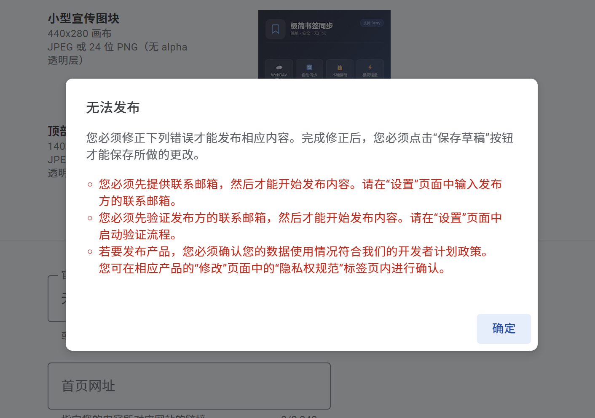

# 极简书签同步

> 轻量、干净、无广告的 Chrome 书签同步工具，通过 WebDAV 协议将书签同步到你的私有云盘。

[](https://chromewebstore.google.com/detail/your-extension-id)
[](LICENSE)

---

## ✨ 功能特色

- 🔄 **多模式同步** — 支持上传、下载、合并三种同步策略
- ⏰ **自动定时同步** — 可设置 5~1440 分钟自动同步间隔
- ☁️ **WebDAV 协议** — 兼容坚果云、Nextcloud、群晖等主流网盘
- 🔒 **数据安全** — 书签数据直连你的云盘，不经过第三方服务器
- 🛡️ **本地备份** — 导入前自动备份，防止意外丢失
- 🧹 **无广告无追踪** — 干净纯粹，没有任何多余功能
- 💾 **书签备份管理** — 支持创建、浏览、导入历史备份
- 📱 **隐私保护** — 完整的[隐私政策](https://jagshen.github.io/Mini-bookmark-sync/privacy.html)

## 📸 界面预览

<table>
  <tr>
    <td align="center">
      <br/>
      <b>配置页面</b>
    </td>
    <td align="center">
      <br/>
      <b>主页</b>
    </td>
    <td align="center">
      <br/>
      <b>新增书签</b>
    </td>
  </tr>
</table>

## 🚀 快速开始

### 1. 安装扩展

**从 Chrome Web Store 安装（推荐）：**

前往 Chrome Web Store 搜索「极简书签同步」点击安装。

**手动安装开发者版本：**

1. 克隆本仓库或下载 ZIP 解压
2. 打开 Chrome，访问 `chrome://extensions/`
3. 开启右上角「开发者模式」
4. 点击「加载已解压的扩展程序」，选择项目文件夹

### 2. 配置 WebDAV

1. 点击扩展图标打开弹窗
2. 进入设置页面
3. 填写 WebDAV 服务器信息：

| 配置项 | 说明 | 示例 |
|--------|------|------|
| 服务器地址 | WebDAV 服务地址 | `https://dav.jianguoyun.com/dav/` |
| 用户名 | 网盘账号或应用专用密码用户名 | `your@email.com` |
| 密码 | 应用专用密码（非登录密码） | `xxxxxxxxxxxx` |
| 书签路径 | 云端书签存储路径 | `/书签同步/bookmarks.json` |

### 3. 开始同步

配置完成后，点击「同步」即可完成首次书签同步。

## ☁️ 支持的 WebDAV 服务

| 服务 | 推荐度 | 备注 |
|------|--------|------|
| 坚果云 | ⭐⭐⭐ | 国内最常用，免费额度足够 |
| Nextcloud | ⭐⭐⭐ | 开源自建，完全可控 |
| 群晖 NAS | ⭐⭐⭐ | WebDAV Server 套件 |
| Teracloud | ⭐⭐ | 免费提供 WebDAV |
| 其他 WebDAV | ⭐ | 支持 RFC 4918 标准即可 |

> 💡 **坚果云用户**：需要在[第三方应用管理](https://www.jianguoyun.com/d/account/security)中创建应用密码，不能使用登录密码。

## 📖 同步模式说明

| 模式 | 说明 | 适用场景 |
|------|------|----------|
| **合并** | 两端书签合并，保留所有书签 | 日常使用（默认） |
| **上传** | 本地覆盖云端 | 以本机为准时使用 |
| **下载** | 云端覆盖本地 | 以云端为准时使用 |

## 🛠️ 技术栈

- Chrome Extension Manifest V3
- 原生 JavaScript（无框架依赖）
- WebDAV 协议通信
- Chrome Storage API 本地存储

## 📁 项目结构

```
Mini-bookmark-sync/
├── manifest.json          # 扩展配置
├── background.js          # Service Worker（同步引擎）
├── popup.html             # 弹窗界面（HTML + CSS + JS）
├── popup.js               # 弹窗交互逻辑
├── privacy.html           # 隐私政策页面
├── icons/                 # 扩展图标
├── images/                # 静态资源
└── promo-440x280.png      # 商店推广图
```

## ❤️ 支持项目

如果你觉得这个工具对你有帮助，欢迎请我喝杯咖啡 ☕

<div align="center">
  
</div>

也可以通过 [Buy Me A Coffee](https://www.buymeacoffee.com/jagshen) 支持。

## 📄 相关链接

- [隐私政策](https://jagshen.github.io/Mini-bookmark-sync/privacy.html)
- [支持与捐赠](https://jagshen.github.io/Mini-bookmark-sync/support.html)
- [问题反馈](https://github.com/jagshen/Mini-bookmark-sync/issues)

## 📜 License

MIT License
