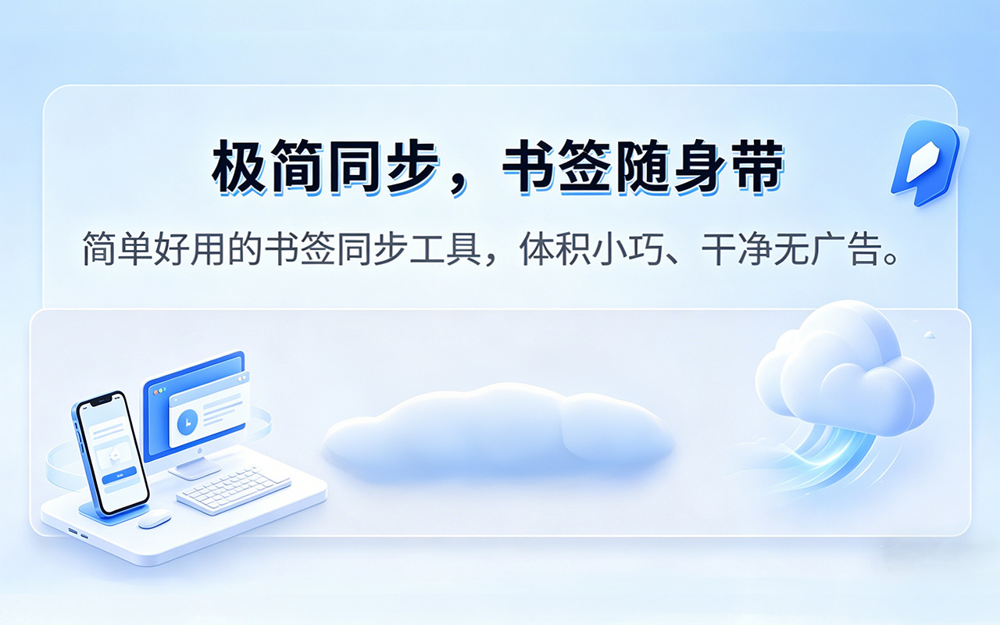
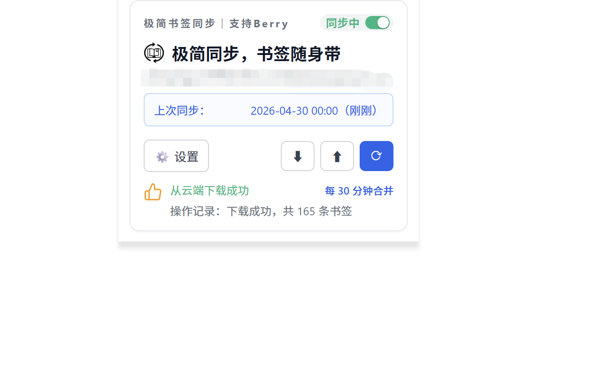
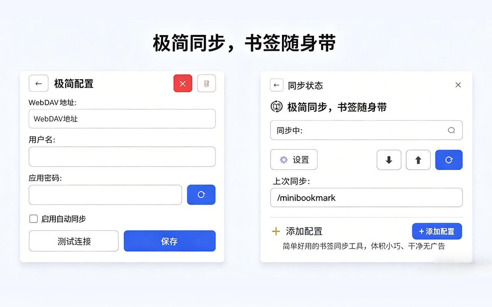

# 极简书签同步

> 轻量、干净、无广告的 Chrome 书签同步工具，通过 WebDAV 协议将书签同步到你的私有云盘。

---

## ✨ 功能特色

- 🔄 多模式同步｜支持上传、下载、双向合并三种同步策略
- ⏰ 定时自动同步｜多种时间间隔，自定义周期省心值守
- ☁️ 兼容 WebDAV｜完美适配坚果云等主流云盘
- 🔒 隐私直连安全｜书签数据直连个人云盘，不经过第三方中转
- 🛡️ 本地自动备份｜导入操作前置自动备份，杜绝数据意外丢失
- 🧹 纯净无干扰｜零广告、无后台追踪，功能纯粹无冗余
- 💾 多端无缝同步｜支持谷歌生态跨设备同步
- 📱 全方位隐私保护｜严守个人书签数据隐私安全，完整的[隐私政策](https://jagshen.github.io/Mini-bookmark-sync/privacy.html)

## 📸 界面预览

<table>
  <tr>
    <td align="center">
      
    </td>
    <td align="center">
      
    </td>
    <td align="center">
      
    </td>
  </tr>
</table>

## 🚀 快速开始

### 1. 安装扩展

前往 [Chrome Web Store](https://chromewebstore.google.com/detail/icpmmfgcjaihgfempcebgnhnadbgofpi) 搜索「极简书签同步」点击安装。

### 2. 配置 WebDAV

1. 点击扩展图标打开弹窗
2. 进入设置页面
3. 填写 WebDAV 服务器信息：

| 配置项 | 说明 | 示例 |
|--------|------|------|
| 服务器地址 | WebDAV 服务地址 | `https://dav.jianguoyun.com/dav/` |
| 用户名 | 网盘账号或应用专用密码用户名 | `your@email.com` |
| 密码 | 应用专用密码（非登录密码） | `xxxxxxxxxxxx` |
| 书签路径 | 云端书签存储路径 | `/minibookmark/bookmarks.json` |

### 3. 开始同步

配置完成后，点击「同步」即可完成首次书签同步。

## ☁️ 支持的 WebDAV 服务

| 服务 | 推荐度 | 备注 |
|------|--------|------|
| [坚果云](https://www.jianguoyun.com) | ⭐⭐⭐ | 国内最常用，免费额度足够 |
| Nextcloud | ⭐⭐⭐ | 开源自建，完全可控 |
| 群晖 NAS | ⭐⭐⭐ | WebDAV Server 套件 |
| Teracloud | ⭐⭐ | 免费提供 WebDAV |
| 其他 WebDAV | ⭐ | 支持 RFC 4918 标准即可 |

> 💡 **坚果云用户**：需要在[第三方应用管理](https://www.jianguoyun.com/#/safety)中创建应用密码，不能使用登录密码。

## 📖 同步模式说明

| 模式 | 说明 | 适用场景 |
|------|------|----------|
| **合并** | 两端书签合并，保留所有书签 | 日常使用（默认） |
| **上传** | 本地覆盖云端 | 以本机为准时使用 |
| **下载** | 云端覆盖本地 | 以云端为准时使用 |

## ❤️ 支持项目

如果你觉得这个工具对你有帮助，欢迎请我喝杯咖啡 ☕

也可以通过 [Buy Me A Coffee](https://jagshen.github.io/Mini-bookmark-sync/support.html) 支持。

## 📄 相关链接

- [隐私政策](https://jagshen.github.io/Mini-bookmark-sync/privacy.html)
- [支持与捐赠](https://jagshen.github.io/Mini-bookmark-sync/support.html)
- [问题反馈](https://github.com/jagshen/Mini-bookmark-sync/issues)
